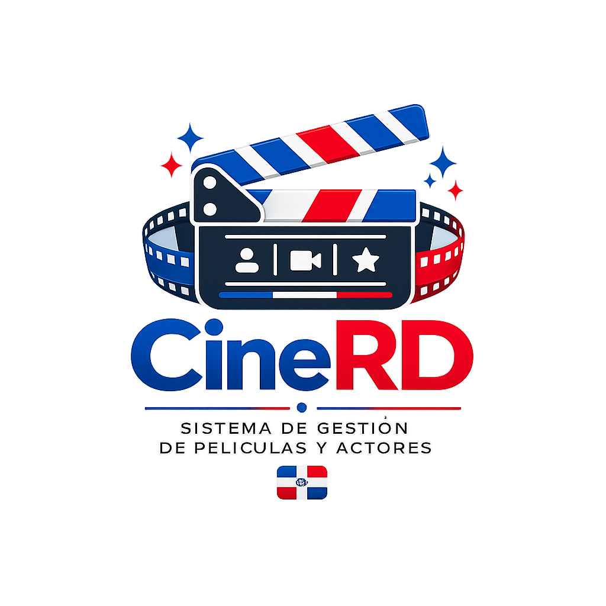

<div align="center">



### La base de datos del cine dominicano

Plataforma Full Stack inspirada en IMDb para preservar, organizar y consultar información sobre películas, talentos y producciones cinematográficas de la República Dominicana.

[](https://github.com/Jairo0811/CineRD)
[](https://github.com/Jairo0811/CineRD)
[](#-licencia)
[](https://github.com/Jairo0811/CineRD/commits/main)

</div>

---

## 🌟 ¿Qué es CineRD?

**CineRD** es un catálogo digital del cine dominicano orientado a preservar, organizar y conectar información sobre películas, talentos, repartos y producción audiovisual de la República Dominicana.

El proyecto evolucionó desde una prueba técnica de React de 2021 hacia una plataforma Full Stack con identidad visual propia, perfiles cinematográficos, autenticación, control de acceso por roles, verificación de talentos, internacionalización e integración con **TMDb**.

La arquitectura actual mantiene **Node.js + Express** en el backend durante la etapa de catálogo. Una futura migración a **.NET** queda reservada para la evolución de CineRD hacia una plataforma de streaming.

---

## ✨ Funcionalidades principales

### 🎬 Películas

- CRUD completo de películas.
- Póster, backdrop, género, director, productora y fecha de estreno.
- Perfil cinematográfico individual.
- Sinopsis, eslogan, duración, calificación, estado e idioma original.
- Presupuesto, recaudación y tráiler.
- Reparto completo y orden de créditos.
- Ranking de producciones con mayor reparto.
- Efemérides con todas las películas del catálogo estrenadas durante el mes actual.
- Integración con TMDb para acelerar el registro y enriquecer metadatos.

### 🎭 Talentos

- Actores, actrices, directores, productores, guionistas, artistas urbanos y otros perfiles profesionales.
- Nombre real y nombre artístico preservados como identidad propia, sin traducciones artificiales.
- Fotografía, profesión y estado.
- Fecha de nacimiento y fallecimiento.
- Edad calculada automáticamente.
- Perfil artístico individual.
- Filmografía como intérprete y películas dirigidas diferenciadas.
- Indicador público de talento verificado.
- Top 10 de talentos con mayor presencia en el catálogo.
- Efemérides de cumpleaños del mes, ordenadas desde el año de nacimiento más antiguo al más reciente.
- Presencia digital mediante perfiles oficiales o profesionales:
  - Facebook
  - X / Twitter
  - Instagram
  - YouTube
  - Spotify
  - TikTok
  - Sitio web oficial

### 👥 Roles y autenticación

CineRD utiliza tres experiencias privadas diferenciadas:

- **USUARIO:** explora el catálogo y puede solicitar la verificación de un perfil.
- **TALENTO_VERIFICADO:** accede a su espacio profesional y puede gestionar únicamente su propio perfil según las reglas de autorización.
- **ADMINISTRADOR:** administra películas, talentos, repartos, verificaciones y métricas globales.

Incluye registro de usuarios, login con contraseña hasheada, JWT Access Token, middleware de autenticación/autorización y protección de rutas en backend y frontend.

### ✅ Verificación de talentos

- Búsqueda del perfil correspondiente.
- Acción `Este soy yo`.
- Métodos de verificación profesional.
- Revisión administrativa.
- Aprobación, rechazo y revocación.
- Vinculación única entre cuenta y perfil artístico.
- Desvinculación administrativa para devolver la cuenta a `USUARIO`.
- Auditoría mediante `AuditLogs`.
- Protección contra vinculaciones profesionales duplicadas.

### 📊 Dashboards por rol

- **Administrador:** Centro de Control con KPIs, Top 10 de talentos, películas con mayor reparto, distribución por género, estrenos documentados por año y actividad reciente.
- **Talento verificado:** espacio profesional conectado con su identidad, filmografía y estado de verificación.
- **Usuario:** Mi CineRD con exploración y seguimiento de solicitudes.

### 🌐 Internacionalización

CineRD incorpora interfaz bilingüe **Español / Inglés** mediante i18n.

Se traducen los elementos de interfaz, etiquetas, navegación, estados y textos editoriales. Se preservan sin traducción automática los **nombres reales**, **nombres artísticos** y **títulos oficiales de las películas**, respetando la identidad de personas y obras.

### 🌐 Integración con TMDb

- Búsqueda de películas y talentos.
- Importación de información e imágenes.
- Importación de repartos.
- Identificación mediante `TMDbId`.
- Detección de coincidencias y duplicados.

### 📦 Catálogo portable para desarrollo

CineRD puede versionar un snapshot reproducible del catálogo de desarrollo para que películas, talentos, repartos y traducciones puedan restaurarse al clonar el proyecto en otra computadora. Las fotografías, pósteres y backdrops continúan viviendo en `backend/uploads` y se sincronizan mediante Git.

Por seguridad, este snapshot **no incluye usuarios, contraseñas, tokens, verificaciones ni auditoría**.

Comandos disponibles desde `backend/`:

```bash
npm run catalog:export
npm run catalog:import
npm run catalog:import:replace
npm run setup:local
```

`catalog:export` genera `database/seeds/catalog.snapshot.json` y valida que la multimedia referenciada exista en `backend/uploads`. `setup:local` crea/prepara la base, aplica todas las migraciones y restaura automáticamente el snapshot cuando está versionado en el repositorio.

---

## 🎨 Experiencia visual

CineRD utiliza una identidad inspirada en el cine dominicano, combinando azul, rojo, blanco y navy con una estética cinematográfica moderna.

La interfaz incluye:

- Home pública cinematográfica.
- Catálogo visual de películas.
- Directorio visual de talentos.
- Perfiles editoriales de películas y talentos.
- Navbar dinámico según sesión y rol.
- Centro de Control administrativo.
- **Light mode y Dark mode** con sistema de tema persistente.
- Contraste específico para componentes claros dentro del modo oscuro.
- Diseño responsive para escritorio, tablet y móvil.

---

## 🚀 Tecnologías

### Frontend

<p>
  
  
  
  
</p>

- React + Vite
- React Router
- Axios
- Bootstrap 5
- Chart.js
- i18n ES/EN
- Sistema de temas Light/Dark

### Backend

<p>
  
</p>

- Node.js
- Express
- MSSQL
- Multer
- Sharp
- bcrypt
- JWT
- dotenv
- CORS

### Base de datos

<p>
  
</p>

- Microsoft SQL Server
- Migraciones SQL idempotentes
- Snapshot portable del catálogo de desarrollo

### Integraciones

- TMDb API
- YouTube
- Redes y perfiles profesionales externos

---

## 🏗️ Arquitectura

```text
CineRD/
├── backend/
│   ├── scripts/
│   │   ├── exportCatalog.js
│   │   ├── importCatalog.js
│   │   └── setupLocal.js
│   └── src/
│       ├── config/
│       ├── controllers/
│       ├── middlewares/
│       ├── routes/
│       ├── services/
│       ├── utils/
│       └── uploads/
├── frontend/
│   └── src/
│       ├── assets/
│       ├── components/
│       ├── pages/
│       ├── services/
│       ├── styles/
│       └── utils/
├── database/
│   ├── migrations/
│   └── seeds/
└── README.md
```

---

## ⚙️ Instalación

### 1. Clonar

```bash
git clone https://github.com/Jairo0811/CineRD.git
cd CineRD
```

### 2. Variables de entorno

Crea `backend/.env` con base en `.env.example` y configura SQL Server, TMDb, JWT y las credenciales iniciales del administrador.

### 3. Dependencias del backend

```bash
cd backend
npm install
```

### 4. Preparación automática de SQL Server y catálogo

Con SQL Server disponible y `backend/.env` configurado:

```bash
npm run setup:local
```

Este comando:

1. crea `CRUDPeliculas` si no existe;
2. aplica `CRUD-Peliculas.sql`;
3. aplica las migraciones `002` a `006` en orden;
4. restaura el snapshot del catálogo si está versionado; las imágenes ya viajan mediante `backend/uploads`.

También puedes ejecutar manualmente:

```text
CRUD-Peliculas.sql
database/migrations/002_peliculas_metadatos.sql
database/migrations/003_usuarios_roles_verificacion.sql
database/migrations/004_actores_redes_sociales.sql
database/migrations/005_verificacion_indices_activos.sql
database/migrations/006_peliculas_traducciones.sql
```

### 5. Crear administrador inicial

```bash
npm run seed:admin
```

### 6. Backend

```bash
npm run dev
```

### 7. Frontend

En otra terminal:

```bash
cd frontend
npm install
npm run dev
```

Frontend: `http://localhost:5173`  
Backend: `http://localhost:3000`

### 🔄 Llevar tu catálogo actual a otra PC

En la computadora que ya contiene tus películas y talentos:

```bash
cd backend
npm run catalog:export
```

Después versiona el snapshot y cualquier imagen nueva:

```bash
git add database/seeds/catalog.snapshot.json backend/uploads
git commit -m "data: update CineRD development catalog"
git push
```

En cualquier otra PC bastará con clonar/actualizar el repositorio y ejecutar:

```bash
cd backend
npm install
npm run setup:local
```

La documentación detallada está en [`database/seeds/README.md`](database/seeds/README.md).

---

## 🔌 Endpoints destacados

```http
GET    /api/peliculas
GET    /api/peliculas/:id/perfil
GET    /api/actores
GET    /api/actores/:id
POST   /api/auth/registro
POST   /api/auth/login
GET    /api/verificaciones/mis-solicitudes
GET    /api/verificaciones/mi-perfil
GET    /api/verificaciones/admin/pendientes
GET    /api/verificaciones/admin/vinculaciones
PATCH  /api/verificaciones/admin/:id/revisar
PATCH  /api/verificaciones/admin/vinculaciones/:id/revocar
```

---

## 🗺️ Roadmap

| Estado | Funcionalidad |
|---|---|
| ✅ | CRUD de películas y talentos |
| ✅ | Gestión de repartos |
| ✅ | Perfiles cinematográficos y artísticos |
| ✅ | Autenticación y RBAC |
| ✅ | Verificación, revocación y desvinculación de talentos |
| ✅ | Dashboards por rol y Centro de Control |
| ✅ | Renovación visual integral |
| ✅ | Redes sociales y Spotify para talentos |
| ✅ | Efemérides de cumpleaños y estrenos |
| ✅ | Top 10 de talentos |
| ✅ | Internacionalización Español / Inglés |
| ✅ | Light mode / Dark mode |
| ✅ | Catálogo portable para desarrollo y demos |
| 🟡 | Galerías multimedia |
| 🟡 | Premios y nominaciones |
| 🟡 | Series dominicanas |
| 🟡 | Buscador global |
| 🟡 | Estadísticas avanzadas |
| 🟡 | Mapa del cine dominicano |
| 🟡 | Despliegue en la nube |
| 🔵 | Evolución futura hacia streaming |
| 🔵 | Migración futura del backend a .NET para la etapa streaming |

---

## 📌 Estado del proyecto

🟢 **Versión 2.3.0 — En desarrollo activo**

CineRD funciona actualmente como un portal cinematográfico dominicano con catálogo público, perfiles profesionales, autenticación, RBAC, verificación de talentos, Centro de Control, efemérides, internacionalización, soporte Light/Dark y un mecanismo reproducible para transportar el catálogo de desarrollo entre equipos.

La prioridad actual es consolidar CineRD como **archivo y plataforma de descubrimiento del cine dominicano** antes de abordar una futura etapa de distribución/streaming.

---

## 👨‍💻 Autor

### Francis Jairo Matías Rosario

**Ingeniero de Software · Desarrollador Full Stack**  
República Dominicana

- [GitHub](https://github.com/Jairo0811)
- [LinkedIn](https://www.linkedin.com/in/jairomatias0811/)

---

## 📄 Licencia

Este proyecto forma parte de mi **portafolio profesional** y fue desarrollado con fines educativos, culturales y de investigación.

CineRD no está afiliado, patrocinado ni respaldado por **TMDb**.

© 2026 Francis Jairo Matías Rosario.
